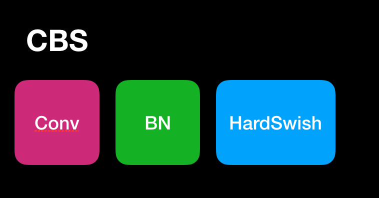

- 服务进行拆分
- 将 AI 服务写成 RPC 服务供调用
- 将 RPC 封装 docker 镜像

# YOLOv5

YOLO 系列一路地走来，并且在竞争激烈的目标检测领域能够有一席之地，必定有其存在。尤其在前阶段， YOLOv4 和 YOLOv5 到底谁说当下王者，网络上作者之间也进行进行激励争论。

YOLO 不断更新，并且吸收其他框架的优点，完成自身不断提升。尤其最近推出的 YOLOv5 在不失初心(小巧轻快)前提下，大大提高了性能。


在 YOLOv5

| 名称  | 说明  |
|---|---|
| Backbone  | 在不同图像细粒度上聚合并形成图像特征的卷积神经网络  |
| Neck  | 一系列混合和组合图像，将图像特征传递到预测层  |
| Head  | 对图像特征进行预测，生成边界框和预测类别  |

|  参数名称 |  参数值 |
|---|---|
|  depth multiple | 0.33  |
|  width multiple | 0.5  |
| from | -1 表示从上一层获得输入 -2 表示从上两层获得输入  |
| number | 1 表示只有一个， 3 表示有 3 个相同模块  |


# m_yolov5
yolov5 with pytorch
最近接触 yolo 比较多，也看了点 yolo 源码，学到了很多，也想自己写一个 yolo 的实现。那么我们还是先从 yolo 网络结构实现开始入手。在开始之前，先看看结构图，然后按结构图来一步一步实现
创建 models 模块，并创建 yolo.py 文件


```python
device = select_device(cfg)
model = Model(cfg).to(device)
```

配置日志输出格式以及级别
```python

def set_logging(rank=-1):
    logging.basicConfig(
            format="%(message)s",
            level=logging.INFO if rank in [-1,0] else logging.WARN)

```
创建 utils 并实现 select_device 方法

```python
def select_device(device='',batch_size=None):
    # device = 'cpu' or 'number'
    cpu_request = device.lower() == 'cpu'
    if device and not cpu_request:#如果使用 gpu
        os.environ['CUDA_VISIBLE_DEVICES'] = device
        # 检测 cuda 是否可用
        assert torch.cuda.is_available(), 'CUDA unavailable invalid device %s requested' % device 
    
    cuda = False if cpu_request else torch.cuda.is_available()

    if cuda:
        # bytes to MB
        c = 1024**2
        
        ng = torch.cuda.device_count()
        # 验证 batch_size 是否与 device_count 匹配
        # 如果确保 6 位有效数字前提下，使用小数方式，否则使用科学计数法
        if ng > 1 and batch_size:
            assert batch_size % ng == 0, 'batch_size %g not multiple of GPU count %g' %(batch_size,ng)
        x = [torch.cuda.get_device_properties(i) for i in range(ng)]
        s = 'Using CUDA'
        for i in range(0,ng):
            if i == 1:
                s = ' '* len(s)
            logging.info("%sdevice%g _CudaDeviceProperties(name='%s',total_memory=%dMB)"%
                (s,i,x[i].name,x[i].total_memory/c))
    else:
        logging.info('Using CPU')

    logging.info('')
    return torch.device('cuda:0'if cuda else 'cpu')
```

## 基础网络结构快
### Conv



这个结构比较基础，传统搭配，卷积层、BN 层，唯一我们需要注意就是激活层没有使用 ReLU 而是使用了比较新的激活函数 Hard

```python
class Conv(nn.Module):

    def __init__(self,c1,c2,k=1,s=1,p=None,g=1,act=True):
        super(Conv,self).__init__()
        self.conv = nn.Conv2d(c1,c2,k,s,autopad(k,p),groups=g,bias=False)
        self.bn = nn.BatchNorm2d(c2)
        self.act = nn.Hardswish() if act else nn.Identity()

    def forward(self,x):
        return self.act(self.bn(self.conv(x)))
    
    def fuseforward(self,x):
        return self.act(self.conv(x))


if __name__ == "__main__":
    conv = Conv(3,16,k=3)
    img = torch.randint(0,255,(1,3,416,416),dtype=torch.float32)
    res = conv(img)
    print(res.shape)
```
- Bottleneck
```python
class Bottleneck(nn.Module):

    def __init__(self,c1,c2,shortcut=True,g=1,e=0.5):
        super(Bottleneck,self).__init__()
        # hidden channels 
        
        c_ = int(c2 * e)
        # [8,416,416]
        self.cv1 = Conv(c1,c_,1,1)
        # [16,416,416]
        self.cv2 = Conv(c_,c2,3,1,g=g)
        self.add = shortcut and c1 == c2

    def forward(self,x):
        # 
        return x + self.cv2(self.cv1(x)) if self.add else self.cv2(self.cv1(x))
```


### DWConv
深度可分离卷积，这个我分享过
### Focus
将图像相邻的四个位置进行堆叠，聚焦 wh 维度信息到 c 通道空间，每个点的提高感受野，并减少原始信息的丢失，有点类似于进行 kernal size = 2 ，stride = 2 的卷积操作。
- BottleneckCSP
- Concat
- NMS
### PANET
模型使用 FPN 作为 NECK，随后更新为 PANET 。PANET 基于 Mask RCNN 和 FPN 框架，加强了信息传播，这样做具有准确保留空间信息的能力。这有助于对像素进行适当的定位以形成 mask

#### hard-swish

$$ f(x) = x \times sigmoid(\beta x) $$

$$ f^{\prime}(x) = 1 \times sigmoid (\beta x) + x(\beta \times sigmoid(\beta x))$$

- $\beta = 0$ 时 $f(x) = \frac{x}{2}$
- $\beta$ 趋近于无穷 $\sigma(x) = (1 + \exp(-x))- \sigma(x) = (1 + \exp(-x))-1 $ 为 0 或 1 ，swish 变为 ReLU $f(x) = 2 \max(0,x)$
所以Swish函数可以看做是介于线性函数与ReLU函数之间的平滑函数. beta是个常数或者可以训练的参数。其具有无上界有下界、平滑、非单调的特性。其在模型效果上优于ReLU。
hard-Swish 介绍
虽然 swish 非线性提高了精度，但是在嵌入式环境中，成本是非零的，因为在移动设备上计算 sigmoid 函数代价要大得多。

$$h-swish(x) = x \frac{ReLU6(x+3)}{6}$$

### 运行时熔断 BN 和 Conv

我们讨论如何通过合并冻结批处理规范化层和前面的卷积来简化网络结构。这是实践中常见的设置，值得研究。批处理规范化（通常缩写为BN）是现代神经网络中常用的一种方法，因为通常可以减少训练时间，并有可能提高泛化能力（但是，围绕它有一些争议：1，2）。

[fusing-batchnorm-and-conv](https://nenadmarkus.com/p/fusing-batchnorm-and-conv/)

### Focal loss
对于 one-stage 检测经常会包含很多先验框，输入图片将划分为若干个网格，每个网格又包含若干个先验框。这样就是使得 one-stage 包含很多先验框，SSD 就包含 8000 多个先验框，其中只有几个框中包含目标，这样就导致正负样本不均衡的问题。为了解决这个问题，而在 Focal loss 中提出通过权重方式来控制正负样本的权重，以及控制容易分类和难分类样本的权重。
#### 控制正负样本的权重
介绍一下交叉熵
$$cross\,entropy = \begin{cases}
    -\log(p) & if\, y = 1\\
    -\log(1-p) & otherwise
\end{cases}$$
可以用 pt 简化交叉熵
$$P_t = \begin{cases}
    p & if\, y = 1\\
    1-p & otherwise
\end{cases}$$

$$cross\,entropy(p,y) = cross\,entropy(P_t) = -\log(P_t)$$

想要降低负样本的影响，可以在常规的损失函数前增加一个系数$\alpha_t$ 与$P_t$ 类似，当标签 $y=1$ 的时候，$\alpha_t = \alpha$ 而当$y=0$ 时候$\alpha_t = 1 - \alpha$ $\alpha$ 的范围也是 0 到 1 之间的数。此时便可以通过设置 $\alpha$ 实现控制正负样本对 loss 的贡献

$$CE(P_t) = -\alpha_t \log(P_t)$$

$$\alpha_t = \begin{cases}
    \alpha & if \, y=1\\
    1- \alpha & otherwise
\end{cases}$$

$$CE(p,y,\alpha) = \begin{cases}
    - \log(p) * \alpha & if\, y= 1\\
    - \log(1 - p) * (1 - \alpha) & if\, y= 0\\
\end{cases}$$

#### 控制容易分类和难分类样本的权重
$$FL(P_t) = -(1 - P_t)^{\gamma} \log(P_t)$$
- $(1- P_t)^{\gamma}$ 称为调制系数
- 当$P_t$ 趋近 0 的时候，调制系数趋近 1，对于总的 loss 的贡献很大，当$P_t$趋近1的时候，调制系数趋近 0 也就是对于总的 loss 的贡献很小
- 当$\gamma = 0$ 的时候，focal loss 就是传统的交叉熵损失，可以通过调整$\gamma$实现调制系数的改变

#### 两个权重控制方法合并
$$FL(P_t) = -\alpha_t(1-P_t)^{\gamma} \log (P_t)$$