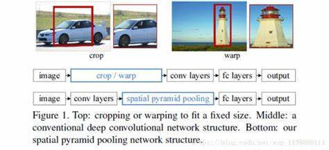

### SPP
在一般的 CNN 结构中，在卷积层后面通常连接着全连接，而全连接层的特征数是固定的，所以在网络输入的时候，会固定输入的大小(fixed-size)。但在实现中，输入图像尺寸总是不能满足输入时要求的大小。通常需要处理裁剪(crop)和拉伸(warp)

在最后的卷积层和全连接层之间加入 SPP层。具体做法是，在 conv5 层得到的特征图是 256 层，每层都做一次 spatial pyramid pooling。先把每个特征图分割成多个不同尺寸的网格，比如网格分别为 4*4、2*2、1*1,然后每个网格做 max pooling，这样 256 层特征图就形成了 16*256，4*256，1*256 维特征，他们连起来就形成了一个固定长度的特征向量，将这个向量输入到后面的全连接层。

实验和竞赛结果表明 SPP-net 在分类和目标检测上都有更好的表现，在detection领域中R-CNN在SPP之前取得的效果最好，但是比较耗时，一个重要原因是在原始图像得到的warped regions会重复使用CNN网络计算feature maps。但是SPP-net只用计算一次整张图像的feature maps。这种方式将计算速度提高了超过100倍，在实验中SPP-net计算features的速度跟R-CNN比较大约可以快24-102x，并且可以达到相同的准确度。

#### SPP 显著特征
- 解决的proposal regions尺寸问题
- 先计算出featuremaps，在表示每个proposal region时候特征图的结果可以共享，节约计算时间
- 不管输入尺寸是怎样，SPP 可以产生固定大小输出
- 使用多个窗口 Pooling window
- SPP 可以使用同一图像不同尺寸(scale)作为输入，得到同样长度的池化特征
#### 其他特点
- 由于对输入图像的不同宽高比和不同尺寸，SPP 同样可以处理，所以提高了图像的尺度不变(scale-invariance)和降低过拟合(over-fitting)
- 实践表示训练图像尺寸的多样性比单一尺寸的训练图像更容易使得网络收敛

在讲解什么是空间金字塔池化之前，我们先从空间金字塔特征说起（这边先不考虑池化）。如下图中，当输入一张图片的时候，利用不同大小的刻度，对一张图片进行了划分。

在图中，利用了三种不同大小的刻度，对一张输入的图片进行了划分，最后总共可以得到16+4+1=21个块，我们即将从这21个块中，每个块提取出一个特征，这样刚好就是我们要提取的 21 维特征向量

空间金字塔最大池化（SPP-Max）的过程，其实就是从这21个图片块中，分别计算每个块的最大值，从而得到一个输出特征向量（跟上一层卷积核深度一样可能是256）。最后把一张任意大小的图片转换成了一个固定大小的21维特征（当然你可以设计其它维数的输出，增加金字塔的层数，或者改变划分网格的大小）。上面的三种不同刻度的划分，每一种刻度我们称之为金字塔的一层，使用多个不同刻度的层，可以提高我们所提取特征的鲁棒性。每一个图片块大小我们称之为：Sliding Windows Size了。如果你希望，金字塔的某一层输出n*n个特征，那么你就要用Windows Size大小为：(w/n,h/n)进行池化了。具体的SPP过程如下图5所示：

#### 多尺度训练
- 定理: 任何给定一个数都可以写成若干个数的平方和
$$a = a_1^2 + a_2^2 + \cdots $$
- 推论: 任何一个数的平方(为一个数)可以表达成若干个数的平方和
$$a^2 = b = a_1^2 + a_2^2 + \cdots$$
由于我们输入图像尺寸是多样的，所以最后一层得到每一个特征图大小 $a\times b$

窗口宽和高分别为$w_1,w_2$ ，这里表示窗口的宽和高
$$w_1 = \frac{a}{n} \, w_2 = \frac{b}{n}$$

$$f=\sum_{i=1} n_i^2$$